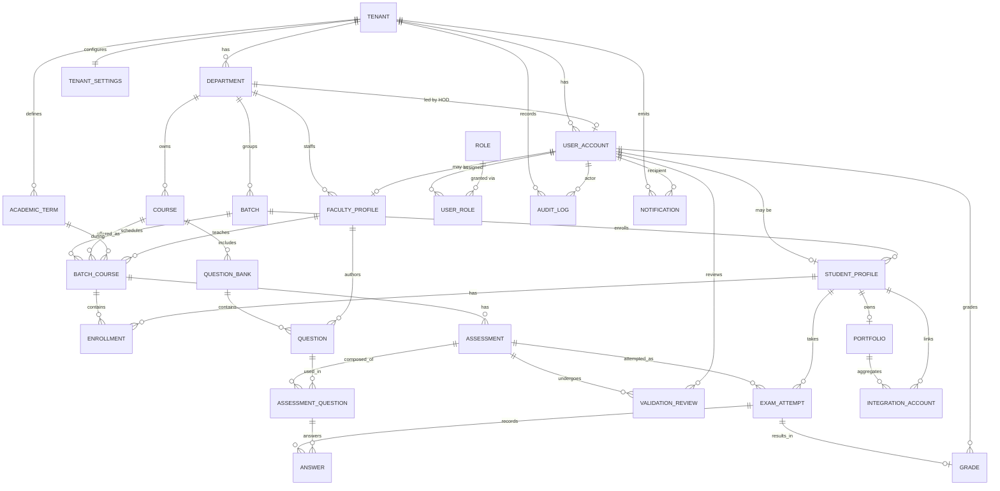

# CollegeCloud — Database Design

PostgreSQL schema design for the CollegeCloud multi-tenant academic platform. Uses `jsonb` for flexible, evolving, and semi-structured data (settings, question payloads, answers, integration snapshots, audit metadata) while keeping relational integrity for core entities.

## Conventions

- **Primary keys**: `uuid` (`gen_random_uuid()` via `pgcrypto`/`uuid-ossp`).
- **Timestamps**: `timestamptz` (UTC). Every table has `created_at` and `updated_at`.
- **Multi-tenancy**: every tenant-scoped table carries `tenant_id uuid` and is protected by Row Level Security (RLS).
- **Enumerations**: implemented as native `enum` types (listed in the Enum Types section).
- **Money/marks**: `numeric(6,2)` for scores/marks, `numeric(5,2)` for percentages.
- **Flexible data**: `jsonb` with GIN indexes where queried.
- **Soft deletes**: `deleted_at timestamptz NULL` where retention/audit matters.

## Entity Relationship Diagram



## Enum Types

```sql
CREATE TYPE tenant_status      AS ENUM ('active', 'suspended', 'pending', 'archived');
CREATE TYPE user_status        AS ENUM ('invited', 'active', 'suspended', 'deactivated');
CREATE TYPE role_key           AS ENUM ('super_admin', 'college_admin', 'exam_controller', 'hod', 'faculty', 'student');
CREATE TYPE batch_status       AS ENUM ('planned', 'active', 'completed', 'archived');
CREATE TYPE enrollment_status  AS ENUM ('enrolled', 'dropped', 'completed', 'withdrawn');
CREATE TYPE question_type      AS ENUM ('mcq_single', 'mcq_multi', 'true_false', 'short_answer', 'long_answer', 'numeric', 'coding');
CREATE TYPE difficulty_level   AS ENUM ('easy', 'medium', 'hard');
CREATE TYPE assessment_type    AS ENUM ('quiz', 'assignment', 'midterm', 'final', 'practice');
CREATE TYPE assessment_status  AS ENUM ('draft', 'submitted_for_validation', 'validated', 'rejected', 'scheduled', 'live', 'closed', 'graded');
CREATE TYPE validation_decision AS ENUM ('pending', 'approved', 'rejected', 'changes_requested');
CREATE TYPE attempt_status     AS ENUM ('not_started', 'in_progress', 'submitted', 'auto_submitted', 'graded', 'flagged');
CREATE TYPE grade_status       AS ENUM ('pending', 'provisional', 'published');
CREATE TYPE integration_provider AS ENUM ('github', 'linkedin');
CREATE TYPE integration_status  AS ENUM ('connected', 'disconnected', 'error', 'syncing');
CREATE TYPE notification_channel AS ENUM ('in_app', 'email', 'sms');
```

## Data Dictionary

Legend — **Req**: required (NOT NULL). PK/FK/UK denote key constraints.

### tenant
Institution/college. Root of tenant isolation.

| Column | Type | Req | Notes |
|---|---|---|---|
| id | uuid | ✓ | PK |
| name | text | ✓ | College name |
| slug | citext | ✓ | UK, subdomain/handle |
| status | tenant_status | ✓ | default `pending` |
| contact_email | citext | ✓ | Primary admin contact |
| contact_phone | text |  | E.164 |
| address | jsonb |  | `{line1,line2,city,state,country,postal_code}` |
| branding | jsonb |  | `{logo_url,primary_color,secondary_color}` |
| onboarding_step | smallint | ✓ | 0–6 wizard progress, default 0 |
| created_at | timestamptz | ✓ | |
| updated_at | timestamptz | ✓ | |

### tenant_settings
One-to-one tenant configuration.

| Column | Type | Req | Notes |
|---|---|---|---|
| tenant_id | uuid | ✓ | PK, FK → tenant |
| grading_scheme | jsonb | ✓ | `{scale:"gpa_10"|"gpa_4"|"percentage", bands:[{grade,min,max}]}` |
| exam_defaults | jsonb | ✓ | `{duration_min,shuffle,neg_marking,attempts}` |
| validation_required | boolean | ✓ | default true |
| feature_flags | jsonb |  | `{portfolios,proctoring,...}` |
| locale | text | ✓ | default `en-IN` |
| timezone | text | ✓ | default `Asia/Kolkata` |
| created_at | timestamptz | ✓ | |
| updated_at | timestamptz | ✓ | |

### department
| Column | Type | Req | Notes |
|---|---|---|---|
| id | uuid | ✓ | PK |
| tenant_id | uuid | ✓ | FK → tenant |
| name | text | ✓ | e.g. Computer Science |
| code | text | ✓ | UK per tenant (e.g. CSE) |
| hod_user_id | uuid |  | FK → user_account |
| description | text |  | |
| created_at | timestamptz | ✓ | |
| updated_at | timestamptz | ✓ | |

### user_account
Auth identity for all roles.

| Column | Type | Req | Notes |
|---|---|---|---|
| id | uuid | ✓ | PK |
| tenant_id | uuid | ✓ | FK → tenant |
| email | citext | ✓ | UK per tenant |
| full_name | text | ✓ | |
| password_hash | text |  | null for SSO-only |
| status | user_status | ✓ | default `invited` |
| avatar_url | text |  | |
| last_login_at | timestamptz |  | |
| preferences | jsonb |  | `{theme,notifications,...}` |
| created_at | timestamptz | ✓ | |
| updated_at | timestamptz | ✓ | |
| deleted_at | timestamptz |  | soft delete |

### role / user_role
`role` is a static catalog; `user_role` assigns roles (many-to-many, scoped).

**role**

| Column | Type | Req | Notes |
|---|---|---|---|
| id | uuid | ✓ | PK |
| key | role_key | ✓ | UK |
| label | text | ✓ | display name |
| permissions | jsonb | ✓ | permission matrix |

**user_role**

| Column | Type | Req | Notes |
|---|---|---|---|
| id | uuid | ✓ | PK |
| user_id | uuid | ✓ | FK → user_account |
| role_id | uuid | ✓ | FK → role |
| scope | jsonb |  | e.g. `{department_id}` for HOD |
| created_at | timestamptz | ✓ | UK (user_id, role_id) |

### faculty_profile
| Column | Type | Req | Notes |
|---|---|---|---|
| id | uuid | ✓ | PK |
| tenant_id | uuid | ✓ | FK → tenant |
| user_id | uuid | ✓ | FK → user_account, UK |
| department_id | uuid | ✓ | FK → department |
| employee_code | text | ✓ | UK per tenant |
| designation | text |  | Professor / Asst. Prof |
| specializations | jsonb |  | `["ML","DBMS"]` |
| max_weekly_load | smallint | ✓ | default 16 |
| current_load | smallint | ✓ | derived, default 0 |
| is_hod | boolean | ✓ | default false |
| created_at | timestamptz | ✓ | |
| updated_at | timestamptz | ✓ | |

### student_profile
| Column | Type | Req | Notes |
|---|---|---|---|
| id | uuid | ✓ | PK |
| tenant_id | uuid | ✓ | FK → tenant |
| user_id | uuid | ✓ | FK → user_account, UK |
| department_id | uuid | ✓ | FK → department |
| batch_id | uuid |  | FK → batch |
| roll_number | text | ✓ | UK per tenant |
| enrollment_year | smallint | ✓ | |
| status | enrollment_status | ✓ | default `enrolled` |
| guardian | jsonb |  | `{name,phone,email,relation}` |
| contact | jsonb |  | `{phone,address}` |
| created_at | timestamptz | ✓ | |
| updated_at | timestamptz | ✓ | |

### batch
Cohort of students (year/section).

| Column | Type | Req | Notes |
|---|---|---|---|
| id | uuid | ✓ | PK |
| tenant_id | uuid | ✓ | FK → tenant |
| department_id | uuid | ✓ | FK → department |
| name | text | ✓ | e.g. CSE-2024-A |
| year | smallint | ✓ | intake year |
| section | text |  | |
| capacity | smallint | ✓ | default 60 |
| enrolled_count | integer | ✓ | derived, default 0 |
| status | batch_status | ✓ | default `planned` |
| created_at | timestamptz | ✓ | |
| updated_at | timestamptz | ✓ | |

### academic_term
| Column | Type | Req | Notes |
|---|---|---|---|
| id | uuid | ✓ | PK |
| tenant_id | uuid | ✓ | FK → tenant |
| name | text | ✓ | e.g. Fall 2025 |
| starts_on | date | ✓ | |
| ends_on | date | ✓ | |
| is_current | boolean | ✓ | default false |

### course
| Column | Type | Req | Notes |
|---|---|---|---|
| id | uuid | ✓ | PK |
| tenant_id | uuid | ✓ | FK → tenant |
| department_id | uuid | ✓ | FK → department |
| code | text | ✓ | UK per tenant (e.g. CS301) |
| title | text | ✓ | |
| credits | numeric(3,1) | ✓ | default 3.0 |
| description | text |  | |
| syllabus | jsonb |  | `{units:[{title,topics[]}]}` |
| created_at | timestamptz | ✓ | |
| updated_at | timestamptz | ✓ | |

### batch_course
A course offering to a batch in a term, taught by a faculty member.

| Column | Type | Req | Notes |
|---|---|---|---|
| id | uuid | ✓ | PK |
| tenant_id | uuid | ✓ | FK → tenant |
| batch_id | uuid | ✓ | FK → batch |
| course_id | uuid | ✓ | FK → course |
| term_id | uuid | ✓ | FK → academic_term |
| faculty_id | uuid |  | FK → faculty_profile |
| schedule | jsonb |  | `[{day,start,end,room}]` |
| created_at | timestamptz | ✓ | UK (batch_id, course_id, term_id) |
| updated_at | timestamptz | ✓ | |

### enrollment
Student ↔ batch_course link with per-course status.

| Column | Type | Req | Notes |
|---|---|---|---|
| id | uuid | ✓ | PK |
| tenant_id | uuid | ✓ | FK → tenant |
| student_id | uuid | ✓ | FK → student_profile |
| batch_course_id | uuid | ✓ | FK → batch_course |
| status | enrollment_status | ✓ | default `enrolled` |
| enrolled_at | timestamptz | ✓ | |
| created_at | timestamptz | ✓ | UK (student_id, batch_course_id) |

### question_bank
| Column | Type | Req | Notes |
|---|---|---|---|
| id | uuid | ✓ | PK |
| tenant_id | uuid | ✓ | FK → tenant |
| course_id | uuid | ✓ | FK → course |
| name | text | ✓ | |
| description | text |  | |
| tags | jsonb |  | `["unit-1","recursion"]` |
| created_at | timestamptz | ✓ | |
| updated_at | timestamptz | ✓ | |

### question
Flexible content stored in `jsonb` to support all question types.

| Column | Type | Req | Notes |
|---|---|---|---|
| id | uuid | ✓ | PK |
| tenant_id | uuid | ✓ | FK → tenant |
| question_bank_id | uuid | ✓ | FK → question_bank |
| author_id | uuid | ✓ | FK → faculty_profile |
| type | question_type | ✓ | |
| difficulty | difficulty_level | ✓ | default `medium` |
| prompt | text | ✓ | question stem |
| body | jsonb | ✓ | `{options[],correct[],rubric,test_cases[],attachments[]}` |
| default_marks | numeric(6,2) | ✓ | default 1 |
| tags | jsonb |  | topic/outcome tags |
| is_active | boolean | ✓ | default true |
| created_at | timestamptz | ✓ | |
| updated_at | timestamptz | ✓ | |

### assessment
Exam/quiz definition; moves through validation → scheduled → live → graded.

| Column | Type | Req | Notes |
|---|---|---|---|
| id | uuid | ✓ | PK |
| tenant_id | uuid | ✓ | FK → tenant |
| batch_course_id | uuid | ✓ | FK → batch_course |
| created_by | uuid | ✓ | FK → user_account (faculty) |
| title | text | ✓ | |
| type | assessment_type | ✓ | |
| status | assessment_status | ✓ | default `draft` |
| total_marks | numeric(6,2) | ✓ | |
| duration_min | smallint | ✓ | |
| opens_at | timestamptz |  | schedule window start |
| closes_at | timestamptz |  | schedule window end |
| config | jsonb | ✓ | `{shuffle,neg_marking,attempts,proctoring}` |
| instructions | text |  | |
| created_at | timestamptz | ✓ | |
| updated_at | timestamptz | ✓ | |

### assessment_question
Join of assessment ↔ question with per-exam ordering/marks.

| Column | Type | Req | Notes |
|---|---|---|---|
| id | uuid | ✓ | PK |
| assessment_id | uuid | ✓ | FK → assessment |
| question_id | uuid | ✓ | FK → question |
| position | smallint | ✓ | order in paper |
| marks | numeric(6,2) | ✓ | override of default_marks |
| section | text |  | grouping label |
| created_at | timestamptz | ✓ | UK (assessment_id, question_id) |

### validation_review
Exam Controller / HOD review of a submitted assessment.

| Column | Type | Req | Notes |
|---|---|---|---|
| id | uuid | ✓ | PK |
| tenant_id | uuid | ✓ | FK → tenant |
| assessment_id | uuid | ✓ | FK → assessment |
| reviewer_id | uuid | ✓ | FK → user_account |
| decision | validation_decision | ✓ | default `pending` |
| comments | text |  | |
| checklist | jsonb |  | `[{item,ok,note}]` |
| reviewed_at | timestamptz |  | |
| created_at | timestamptz | ✓ | |

### exam_attempt
A student's attempt at an assessment.

| Column | Type | Req | Notes |
|---|---|---|---|
| id | uuid | ✓ | PK |
| tenant_id | uuid | ✓ | FK → tenant |
| assessment_id | uuid | ✓ | FK → assessment |
| student_id | uuid | ✓ | FK → student_profile |
| status | attempt_status | ✓ | default `not_started` |
| started_at | timestamptz |  | |
| submitted_at | timestamptz |  | |
| time_spent_sec | integer |  | |
| proctoring | jsonb |  | `{events:[{type,ts}],flags[]}` |
| created_at | timestamptz | ✓ | UK (assessment_id, student_id, attempt_no) |
| attempt_no | smallint | ✓ | default 1 |

### answer
Per-question response inside an attempt.

| Column | Type | Req | Notes |
|---|---|---|---|
| id | uuid | ✓ | PK |
| attempt_id | uuid | ✓ | FK → exam_attempt |
| assessment_question_id | uuid | ✓ | FK → assessment_question |
| response | jsonb | ✓ | `{selected[],text,code,files[]}` |
| awarded_marks | numeric(6,2) |  | null until graded |
| is_correct | boolean |  | auto-scored types |
| feedback | text |  | |
| graded_by | uuid |  | FK → user_account |
| created_at | timestamptz | ✓ | UK (attempt_id, assessment_question_id) |
| updated_at | timestamptz | ✓ | |

### grade
Final/aggregate result for an attempt.

| Column | Type | Req | Notes |
|---|---|---|---|
| id | uuid | ✓ | PK |
| tenant_id | uuid | ✓ | FK → tenant |
| attempt_id | uuid | ✓ | FK → exam_attempt, UK |
| student_id | uuid | ✓ | FK → student_profile |
| score | numeric(6,2) | ✓ | raw marks |
| percentage | numeric(5,2) | ✓ | |
| letter_grade | text |  | derived from scheme |
| status | grade_status | ✓ | default `pending` |
| published_at | timestamptz |  | |
| graded_by | uuid |  | FK → user_account |
| breakdown | jsonb |  | per-section/outcome scores |
| created_at | timestamptz | ✓ | |
| updated_at | timestamptz | ✓ | |

### portfolio
Student's aggregated profile for resume generation.

| Column | Type | Req | Notes |
|---|---|---|---|
| id | uuid | ✓ | PK |
| tenant_id | uuid | ✓ | FK → tenant |
| student_id | uuid | ✓ | FK → student_profile, UK |
| headline | text |  | |
| summary | text |  | |
| visibility | jsonb | ✓ | `{github:true,linkedin:true,grades:false}` |
| sections | jsonb |  | ordered resume sections snapshot |
| last_generated_at | timestamptz |  | |
| created_at | timestamptz | ✓ | |
| updated_at | timestamptz | ✓ | |

### integration_account
Linked GitHub/LinkedIn account and its synced snapshot.

| Column | Type | Req | Notes |
|---|---|---|---|
| id | uuid | ✓ | PK |
| tenant_id | uuid | ✓ | FK → tenant |
| student_id | uuid | ✓ | FK → student_profile |
| provider | integration_provider | ✓ | |
| status | integration_status | ✓ | default `connected` |
| external_username | text |  | |
| scopes | jsonb |  | granted OAuth scopes |
| snapshot | jsonb |  | `{repos[],skills[],certs[]}` cached data |
| access_token | text |  | encrypted at rest |
| refresh_token | text |  | encrypted at rest |
| token_expires_at | timestamptz |  | |
| last_synced_at | timestamptz |  | |
| created_at | timestamptz | ✓ | UK (student_id, provider) |
| updated_at | timestamptz | ✓ | |

### notification
| Column | Type | Req | Notes |
|---|---|---|---|
| id | uuid | ✓ | PK |
| tenant_id | uuid | ✓ | FK → tenant |
| recipient_id | uuid | ✓ | FK → user_account |
| channel | notification_channel | ✓ | default `in_app` |
| title | text | ✓ | |
| body | text |  | |
| payload | jsonb |  | deep-link/context |
| read_at | timestamptz |  | |
| created_at | timestamptz | ✓ | |

### audit_log
Append-only trail for compliance.

| Column | Type | Req | Notes |
|---|---|---|---|
| id | uuid | ✓ | PK |
| tenant_id | uuid | ✓ | FK → tenant |
| actor_id | uuid |  | FK → user_account |
| action | text | ✓ | e.g. `assessment.validated` |
| entity_type | text | ✓ | table/domain name |
| entity_id | uuid |  | |
| metadata | jsonb |  | before/after diff, IP, UA |
| created_at | timestamptz | ✓ | |

## JSONB Usage Summary

| Table.Column | Purpose | Suggested index |
|---|---|---|
| tenant.address / branding | Structured but rarely queried | — |
| tenant_settings.grading_scheme / exam_defaults | Config blobs | — |
| question.body | Options, correct answers, rubric, test cases | GIN on `tags` |
| assessment.config | Exam behavior flags | — |
| answer.response | Polymorphic student response | — |
| exam_attempt.proctoring | Event stream | — |
| integration_account.snapshot | Cached GitHub/LinkedIn data | GIN |
| audit_log.metadata | Diff + request context | GIN |

```sql
-- Example GIN indexes for jsonb querying
CREATE INDEX idx_question_tags ON question USING gin (tags jsonb_path_ops);
CREATE INDEX idx_integration_snapshot ON integration_account USING gin (snapshot jsonb_path_ops);
CREATE INDEX idx_audit_metadata ON audit_log USING gin (metadata jsonb_path_ops);
```

## Row Level Security (tenant isolation)

Every tenant-scoped table enables RLS and filters by the current tenant claim:

```sql
ALTER TABLE department ENABLE ROW LEVEL SECURITY;

CREATE POLICY tenant_isolation ON department
  USING (tenant_id = current_setting('app.current_tenant_id')::uuid);
```

Apply the same pattern to every table carrying `tenant_id`. Role-specific policies (e.g. a student only sees their own `exam_attempt`/`grade`, an HOD only their department) layer additional `USING` clauses on top.
